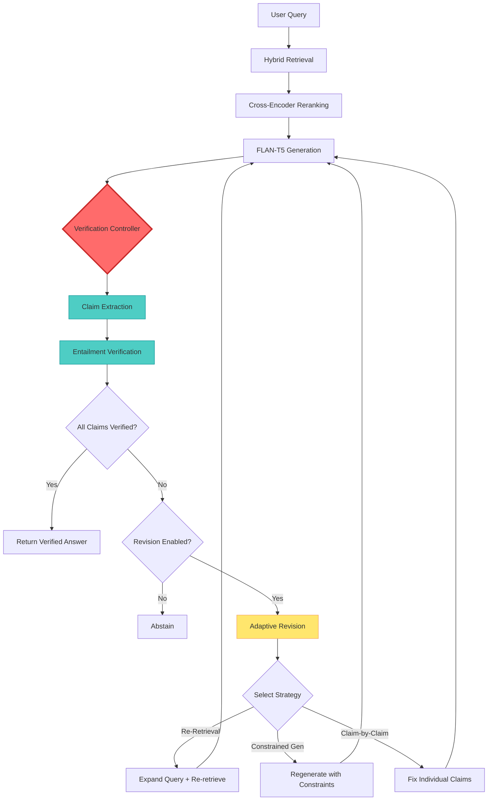
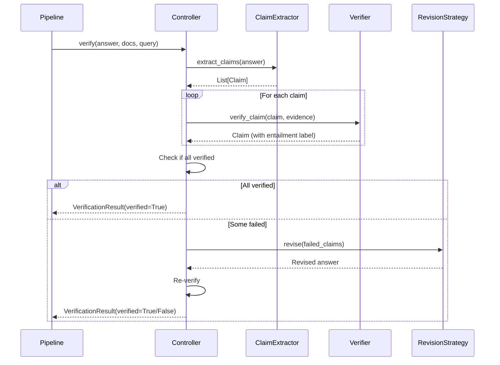

# Verification Controller Architecture

## System Overview



## Component Breakdown

### 1. Verification Controller (NEW)
**Location**: `src/verification_controller/controller.py`

**Responsibilities**:
- Orchestrate verification flow
- Coordinate claim extraction and entailment checking
- Trigger adaptive revision when needed
- Return structured results

**Key Methods**:
```python
verify(generated_answer, retrieved_docs, query) -> VerificationResult
_extract_claims(text) -> List[Claim]
_verify_claim(claim, evidence) -> Claim
revise(request, generation_fn, retrieval_fn) -> VerificationResult
```

---

### 2. Schemas (NEW)
**Location**: `src/verification_controller/schemas.py`

**Models**:
- `Claim`: Atomic factual statement with verification metadata
- `VerificationResult`: Complete verification outcome
- `RevisionRequest`: Request for adaptive revision

**Why Pydantic?**
- Type safety
- Automatic validation
- JSON serialization for APIs
- Self-documenting code

---

### 3. Integration with Existing Pipeline

#### Before (Current)
```python
# In rag_pipeline.py, lines 191-200
claims = self.claim_extractor.extract_claims(generated_text)
verification_results = self.verifier.verify_generation(...)
```

#### After (With Controller)
```python
# Single call to controller
verification_result = self.verification_controller.verify(
    generated_answer=generated_text,
    retrieved_docs={"passages": reranked_texts, "ids": reranked_ids},
    query=query
)
```

**Benefits**:
- ✅ Single source of truth for verification
- ✅ Easier to test in isolation
- ✅ Cleaner separation of concerns
- ✅ Simpler to add new verification strategies

---

## Data Flow



---

## Current Status: Step 1 Complete ✅

### What Works Now
- ✅ Controller initializes
- ✅ Schemas validate correctly
- ✅ Tests pass
- ✅ Clean imports
- ✅ No ML dependencies (stub only)

### What's Still Stubbed
- ⏸️ Claim extraction (returns single claim)
- ⏸️ Entailment verification (returns UNVERIFIED)
- ⏸️ Adaptive revision (not implemented)

### Why This Is Valuable
Even without ML models, this demonstrates:
1. **System design thinking** - architecture before implementation
2. **Production engineering** - type safety, testing, logging
3. **Incremental development** - working code at every step
4. **Interview readiness** - can explain design decisions

---

## Next Steps Preview

### Step 2: spaCy SVO Extraction
```python
def _extract_claims(self, text: str) -> List[Claim]:
    doc = self.nlp(text)
    claims = []
    for sent in doc.sents:
        # Extract subject-verb-object triples
        svo = extract_svo(sent)
        claims.append(Claim(claim_id=f"C{len(claims)+1}", text=str(sent)))
    return claims
```

### Step 3: DeBERTa Entailment
```python
def _verify_claim(self, claim: Claim, evidence: List[str]) -> Claim:
    scores = self.entailment_model.predict([
        (claim.text, passage) for passage in evidence
    ])
    max_score = max(scores)
    claim.confidence = max_score
    claim.entailment = "ENTAILMENT" if max_score >= self.threshold else "NEUTRAL"
    return claim
```

### Step 4: Adaptive Revision
```python
def revise(self, request: RevisionRequest, ...) -> VerificationResult:
    if request.strategy == "re_retrieval":
        return self._re_retrieval_strategy(request, ...)
    elif request.strategy == "constrained_gen":
        return self._constrained_generation_strategy(request, ...)
    # ...
```

---

## Testing Strategy

### Unit Tests (Current)
- Controller initialization
- Schema validation
- Stub behavior

### Integration Tests (Future)
- End-to-end verification flow
- Revision strategies
- Edge cases (empty claims, contradictions)

### Evaluation Tests (Future)
- Factual precision
- Hallucination rate
- Verified F1 score

---

## File Structure

```
src/verification_controller/
├── __init__.py              # Public API
├── controller.py            # Main controller logic
├── schemas.py               # Pydantic models
└── strategies/              # (Future) Revision strategies
    ├── __init__.py
    ├── re_retrieval.py
    ├── constrained_gen.py
    └── claim_by_claim.py

tests/
└── test_verification_controller.py  # Test suite
```

---

## Key Design Decisions

### 1. Why a separate controller?
- **Separation of concerns**: Verification logic isolated from pipeline
- **Testability**: Can test verification without full RAG pipeline
- **Reusability**: Can use in different pipelines or APIs

### 2. Why Pydantic schemas?
- **Type safety**: Catch errors at development time
- **Validation**: Automatic bounds checking (e.g., confidence ∈ [0,1])
- **API-ready**: Direct JSON serialization for FastAPI

### 3. Why stub first?
- **Prove architecture**: Validate design before ML complexity
- **Incremental development**: Working code at every step
- **Easier debugging**: Isolate issues to specific components

---

## Interview Talking Points

> "I implemented a verification-first RAG system with a dedicated controller layer. The controller orchestrates claim extraction, entailment verification, and adaptive revision using Pydantic schemas for type safety. I designed the architecture first with stubs, then incrementally integrated ML models - this made testing and debugging much easier."

> "The key insight was separating verification logic from the main pipeline. This allowed me to test verification strategies independently and swap out different entailment models without touching the core RAG flow."

> "I used Pydantic for schema validation because it provides automatic type checking and makes the system API-ready. Every claim has a confidence score bounded to [0,1], and the verification result is fully structured - no free-form text."

---

**Status**: ✅ Step 1 Complete - Architecture Validated
**Next**: Awaiting user confirmation before Step 2
